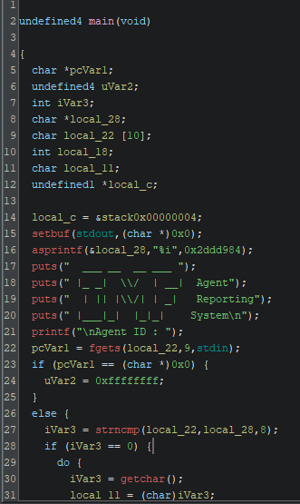
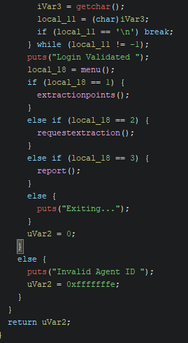

# Ghidra - Búsqueda del Agent ID

Este repositorio contiene la documentación del proceso para identificar el **Agent ID** usando **Ghidra**.

> **Resultado clave:** La constante hexadecimal encontrada en el binario (`0x2DDD984`) se convierte a decimal y esa cadena decimal (8 dígitos) es el **Agent ID** esperado: **48093572**.

---





---

## Resumen del flujo observado (paso a paso)

1. `asprintf(&local_28, "%i", 0x2DDD984);`  
   El programa llama a `asprintf` con formato `"%i"` y la constante `0x2DDD984`. `asprintf` convierte el número a **decimal** y devuelve un puntero en `local_28`.  
   **Conclusión:** la entrada esperada es la cadena decimal equivalente a `0x2DDD984`.

2. `puts(...)` y `printf("\nAgent ID : ");`  
   El binario imprime mensajes y solicita el *Agent ID* por `stdin`.

3. `pcVar1 = fgets(local_22, 9, stdin);`  
   `fgets` con tamaño `9` lee hasta **8 caracteres** y añade el terminador `\0`. Si se escribe menos, `fgets` puede incluir el `\n` en el buffer.

4. `if (pcVar1 == NULL) { ... }`  
   Manejo de error si la lectura falla.

5. `iVar3 = strncmp(local_22, local_28, 8);`  
   Se comparan **exactamente 8 bytes** de la entrada con la cadena decimal generada. La comparación fija en 8 bytes define que la cadena esperada es de 8 caracteres.

6. `if (iVar3 == 0) { /* Login Validated */ } else { puts("Invalid Agent ID"); }`  
   Coincidencia → login validado; en caso contrario, fallo.

---

## Conversión hex → decimal

Uso python para convertir la constante:

```bash
python -c "print(0x2DDD984)"
# imprime: 48093572
